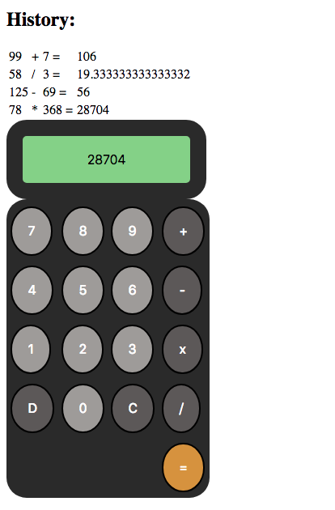

# jQuery Calculator Code Challenge
A simple calculator app with calculation logic done server-side. There is a history feature for keeping track of any calculations recently made. The 'D' button will clear the calculator's current display and exit out of current calculation. The 'C' button clears the history. 

## Calculator 
                

### Tech Used

* jQuery
* Node.js
* Express.js
* HTLM5
* CSS3
